 # Production Demand Forecasting & Inventory Optimization Pipeline

End-to-end retail demand forecasting system — from raw sales data to a deployed FastAPI prediction API on AWS Cloud with Keras deep learning models, XGBoost, LightGBM, and DSA-optimized inventory allocation.

<p align="left">
<a href="https://www.python.org" target="_blank" rel="noreferrer"></a>
<a href="https://www.tensorflow.org/" target="_blank" rel="noreferrer"></a>
<a href="https://keras.io/" target="_blank" rel="noreferrer"></a>
<a href="https://xgboost.readthedocs.io/" target="_blank" rel="noreferrer"></a>
<a href="https://lightgbm.readthedocs.io/" target="_blank" rel="noreferrer"></a>
<a href="https://fastapi.tiangolo.com/" target="_blank" rel="noreferrer"></a>
<a href="https://scikit-learn.org/" target="_blank" rel="noreferrer"></a>
<a href="https://www.postgresql.org" target="_blank" rel="noreferrer"></a>
<a href="https://aws.amazon.com" target="_blank" rel="noreferrer"></a>
<a href="https://www.docker.com/" target="_blank" rel="noreferrer"></a>
<a href="https://developer.mozilla.org/en-US/docs/Web/mlflow" target="_blank" rel="noreferrer">  </a> 
<a href="https://developer.mozilla.org/en-US/docs/Web/chartjs" target="_blank" rel="noreferrer">  </a>
 <a href="https://developer.mozilla.org/en-US/docs/Web/seaborn" target="_blank" rel="noreferrer">  </a>
<a href="https://git-scm.com/" target="_blank" rel="noreferrer"></a>
<a href="https://github.com/features/actions" target="_blank" rel="noreferrer"></a>
<a href="https://pandas.pydata.org/" target="_blank" rel="noreferrer"></a>
<a href="https://numpy.org/" target="_blank" rel="noreferrer"></a>
<a href="https://matplotlib.org/" target="_blank" rel="noreferrer"></a>
<a href="https://docs.pytest.org/" target="_blank" rel="noreferrer"></a>
<a href="https://www.tableau.com/" target="_blank" rel="noreferrer"></a>
<a href="#algorithms--data-structures" target="_blank" rel="noreferrer"></a>
</p>


## Architecture

```
┌─────────────┐    ┌──────────────┐    ┌───────────────┐    ┌──────────────┐
│  Raw Data   │───▶│ Data Cleaning│───▶│   Feature     │───▶│   Model      │
│ 420K sales  │    │ Dedup, Types │    │ Engineering   │    │  Training    │
│ 50 stores   │    │ Validation   │    │ 26 features   │    │ 6 models     │
└─────────────┘    └──────────────┘    └───────────────┘    └──────┬───────┘
                                                                   │
                   ┌──────────────┐    ┌───────────────┐           │
                   │   FastAPI    │◀───│  Inventory    │◀──────────┘
                   │ Forecast API │    │  Optimizer    │
                   │  /predict    │    │ DP + BinSearch│
                   └──────┬───────┘    └───────────────┘
                          │
              ┌───────────┴────────────┐
              │   AWS Cloud Deploy     │
              │  EC2 + S3 + RDS        │
              └────────────────────────┘
```

---

## Model Performance

| Model | MAE | RMSE | R² | MAPE | Train Time |
|-------|-----|------|----|------|------------|
| **XGBoost** | **0.2286** | **0.4379** | **0.9982** ✓ Best | **2.09%** | 7.09s |
| LightGBM | 0.3337 | 0.5087 | 0.9976 | 3.70% | 6.19s |
| LSTM | 6.9421 | 9.2088 | 0.2218 | 105.11% | 1470.83s |
| BiGRU | 7.0119 | 9.1440 | 0.2327 | 110.69% | 588.18s |
| CNN-LSTM | 7.2500 | 9.3508 | 0.1976 | 118.70% | 158.09s |
| Attention | 7.1805 | 9.3550 | 0.1969 | 113.87% | 641.71s |

Best model selected by R² score. 6 models trained: 4 Keras deep learning + 2 gradient boosting. MLflow used for experiment tracking.

<p align="center">
  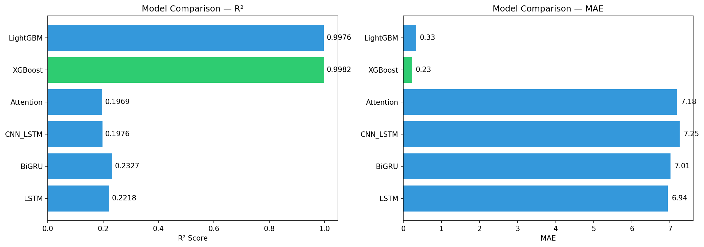
  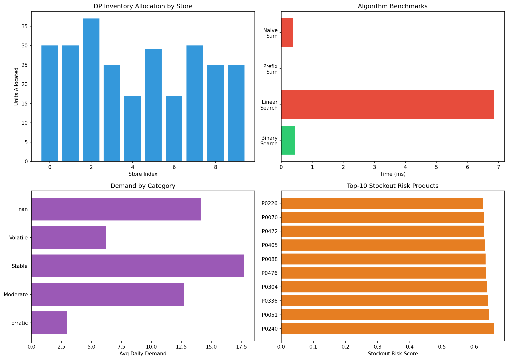
</p>

---

## Inventory Optimization

Dynamic Programming and Binary Search optimize inventory allocation across stores:

| Metric | Value |
|--------|-------|
| Fill Rate | 100.0% |
| Inventory Used | 265 units |
| Inventory Remaining | 4,735 units |
| Safety Stock | 147 units |
| Reorder Point | 245 units |
| Service Level | 95% |
| Anomalies Detected | 0 |

---

## Tech Stack

| Layer | Technology |
|-------|-----------|
| **Deep Learning** | TensorFlow/Keras — LSTM, BiGRU, CNN-LSTM, Attention |
| **ML** | XGBoost, LightGBM, scikit-learn |
| **DSA** | Dynamic Programming, Binary Search, Sliding Window, Min-Heap, LRU Cache, Hash Map |
| **API** | FastAPI, Uvicorn, Pydantic validation |
| **Database** | PostgreSQL on AWS RDS, SQLAlchemy ORM |
| **Cloud** | AWS EC2, AWS S3, AWS RDS |
| **Experiment Tracking** | MLflow |
| **Data** | Pandas, NumPy, Statsmodels, SciPy |
| **DevOps** | Docker, GitHub Actions CI/CD, Git |
| **Testing** | pytest |
| **Visualization** | Tableau, Matplotlib, Seaborn, Chart.js |

---

## Project Structure

```
smart-retail-demand/
├── run_pipeline.py              # One-click: generate → clean → engineer → train → optimize → test
├── requirements.txt
├── Dockerfile
├── .github/workflows/ci.yml    # CI: lint + test on every push
│
├── src/
│   ├── data_cleaning.py         # Type casting, validation, derived columns
│   ├── feature_engineering.py   # 26 features — rolling stats, lag, cyclical encoding
│   ├── model_training.py        # LSTM, BiGRU, CNN-LSTM, Attention, XGBoost, LightGBM
│   ├── inventory_optimizer.py   # DP allocation, binary search reorder, sliding window
│   ├── api/
│   │   ├── forecasting_api.py   # FastAPI endpoints: /predict, /batch, /inventory
│   │   └── schemas.py           # Pydantic request/response models
│   └── utils/
│       ├── algorithms.py        # DP, binary search, sliding window, min-heap
│       └── data_structures.py   # LRU Cache, SortedDemandArray, DemandBucketMap
│
├── sql/
│   ├── 01_create_schema.sql     # PostgreSQL schema
│   ├── 02_create_tables.sql     # Table definitions
│   ├── 03_etl_pipeline.sql      # SQL-based ETL
│   ├── 04_feature_engineering.sql
│   └── 05_analytics_views.sql   # Aggregated views for dashboards
│
├── tests/
│   ├── test_algorithms.py       # DP, binary search, sliding window tests
│   ├── test_api.py              # API schema validation tests
│   └── test_data_structures.py  # LRU cache, sorted array, bucket map tests
│
├── data/
│   ├── raw/                     # retail_sales.csv, products.csv, stores.csv
│   └── processed/               # cleaned_sales.csv, model_metrics.csv
│
├── models/                      # Trained .keras + .pkl + metrics JSON
├── reports/figures/             # Model comparison & optimization charts
├── dashboards/                  # Interactive HTML dashboard
├── screenshots/                 # Tableau + Swagger UI + AWS Cloud screenshots
└── benchmarks/                  # Performance benchmarking suite
```

---

## Quick Start

### 1. Clone & Setup

```bash
git clone https://github.com/gitadi2/smart-retail-demand.git
cd smart-retail-demand
python -m venv venv
venv\Scripts\activate        # Windows
# source venv/bin/activate   # macOS/Linux
pip install -r requirements.txt
```

### 2. Configure Environment

```bash
cp config/.env.example .env
# Edit .env with your database credentials
```

### 3. Run Full Pipeline

```bash
python run_pipeline.py
```

This runs all 6 stages:
1. **Generate** sample data (420K sales across 50 stores)
2. **Clean** — type casting, validation, derived columns
3. **Engineer** — 26 features: rolling means, lag, cyclical encoding
4. **Train** — 6 models (4 Keras DL + XGBoost + LightGBM) with MLflow tracking
5. **Optimize** — DP inventory allocation, binary search reorder points
6. **Test** — pytest suite

### 4. Launch Forecasting API

```bash
uvicorn src.api.forecasting_api:app --port 8000
```

Open Swagger UI: [http://localhost:8000/docs](http://localhost:8000/docs)

### 5. Run Tests

```bash
pytest tests/ -v
```

---

## API Endpoints

| Endpoint | Method | Description |
|----------|--------|-------------|
| `/health` | GET | Model status, cache stats, version |
| `/predict` | POST | Single demand forecast |
| `/predict/batch` | POST | Batch forecast (up to 500 items) |
| `/inventory/allocate` | POST | DP-based inventory allocation across stores |
| `/cache/stats` | GET | Cache utilization metrics |
| `/cache/clear` | POST | Clear prediction cache |

**Example Request:**

```bash
curl -X POST http://localhost:8000/predict \
  -H "Content-Type: application/json" \
  -d '{
    "store_id": "S012",
    "product_id": "P0133",
    "category": "Snacks",
    "month": 10,
    "day_of_week": 4,
    "is_promotion": false,
    "is_holiday": false
  }'
```

**Example Response:**

```json
{
  "store_id": "S012",
  "product_id": "P0133",
  "predicted_demand": 15.3,
  "confidence_interval": {"lower": 12.1, "upper": 18.5},
  "model_used": "XGBoost",
  "cached": false
}
```

---

## Algorithms & Data Structures

| Component | Complexity | Purpose |
|-----------|-----------|---------|
| **DP Inventory Allocation** | O(n × W) | Optimal stock distribution across stores |
| **Binary Search Reorder** | O(log n) | Find optimal reorder point for service level |
| **Sliding Window** | O(n) single pass | Rolling demand anomaly detection |
| **Min-Heap Top-K** | O(n log k) | Identify top stockout risk products |
| **LRU Cache** | O(1) get/put | Cache repeated prediction requests |
| **SortedDemandArray** | O(log n) query | Fast percentile & threshold lookups |
| **DemandBucketMap** | O(1) lookup | Demand aggregation by segment |

---

## Screenshots

<p align="center">
  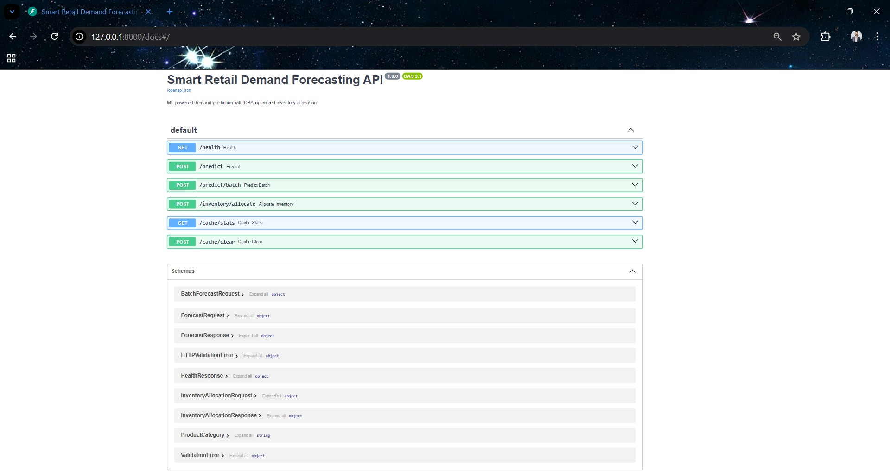
</p>

<p align="center">
  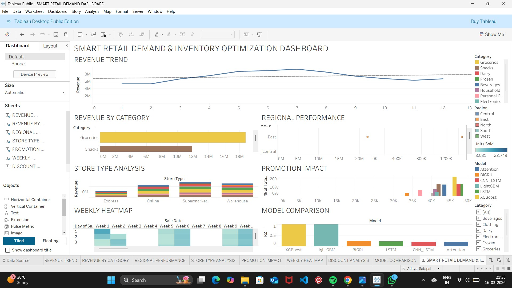
</p>

<p align="center">
  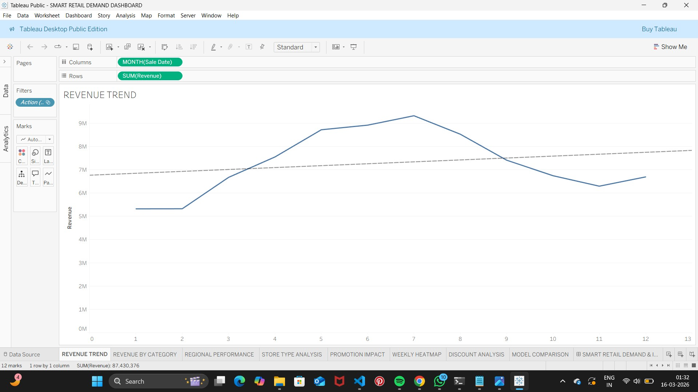
  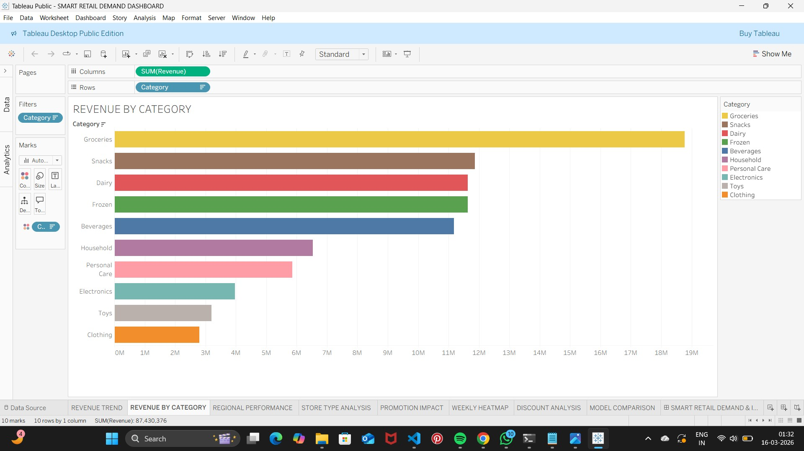
</p>

<p align="center">
  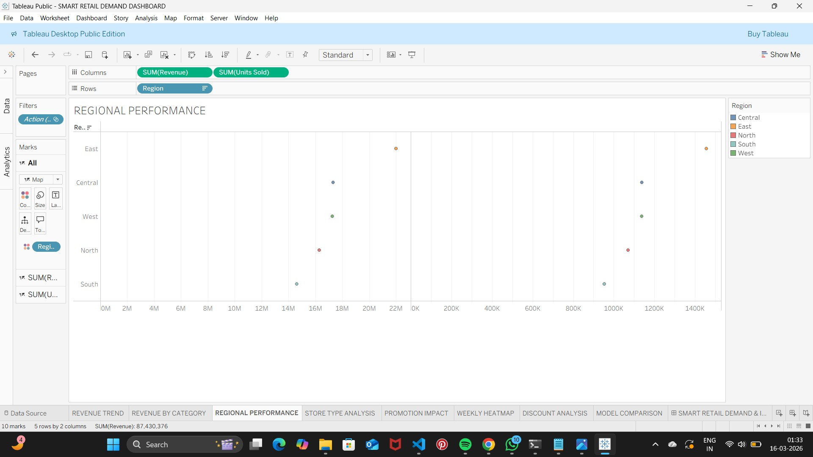
  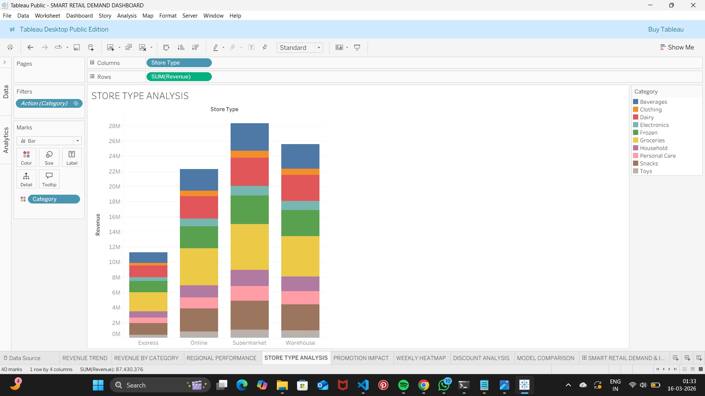
</p>

<p align="center">
  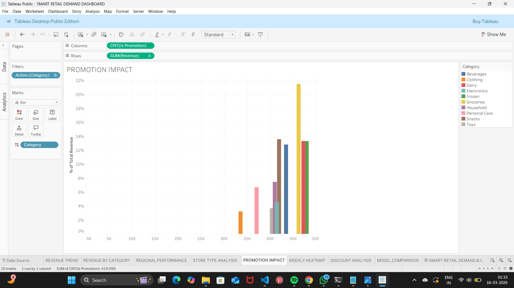
  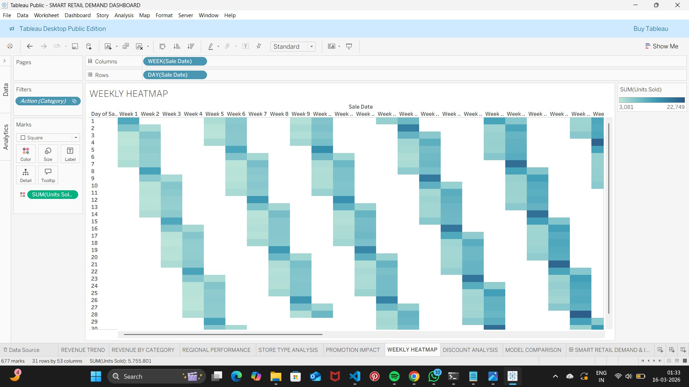
</p>

<p align="center">
  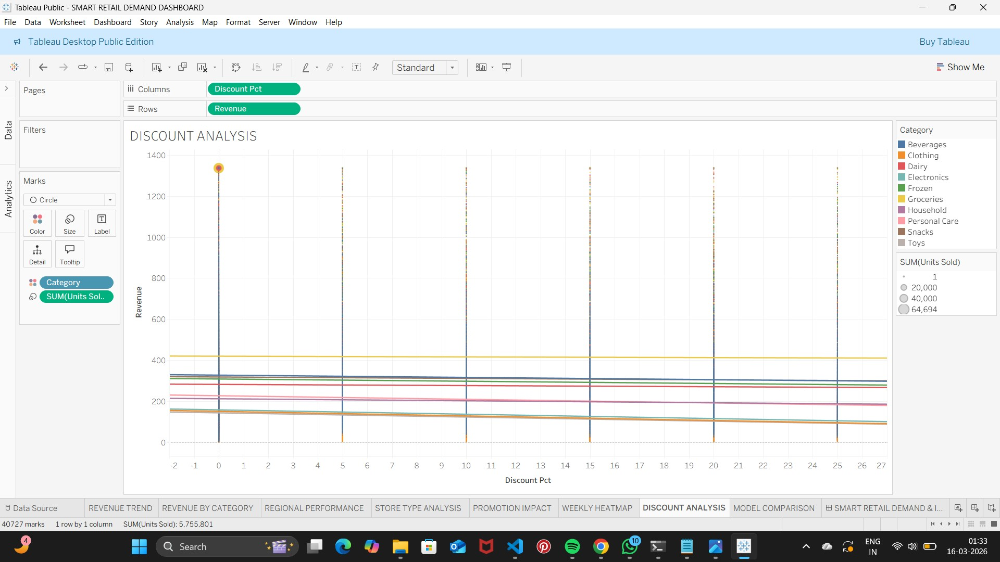
  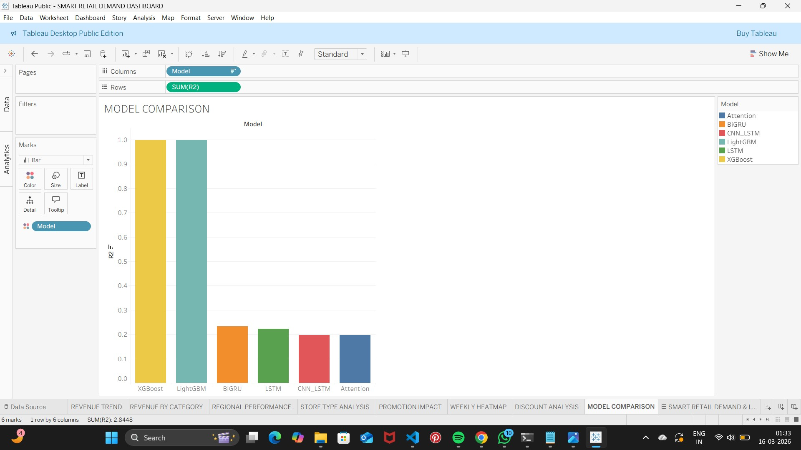
</p>

<p align="center">
  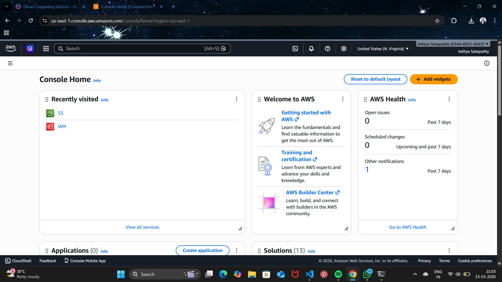
  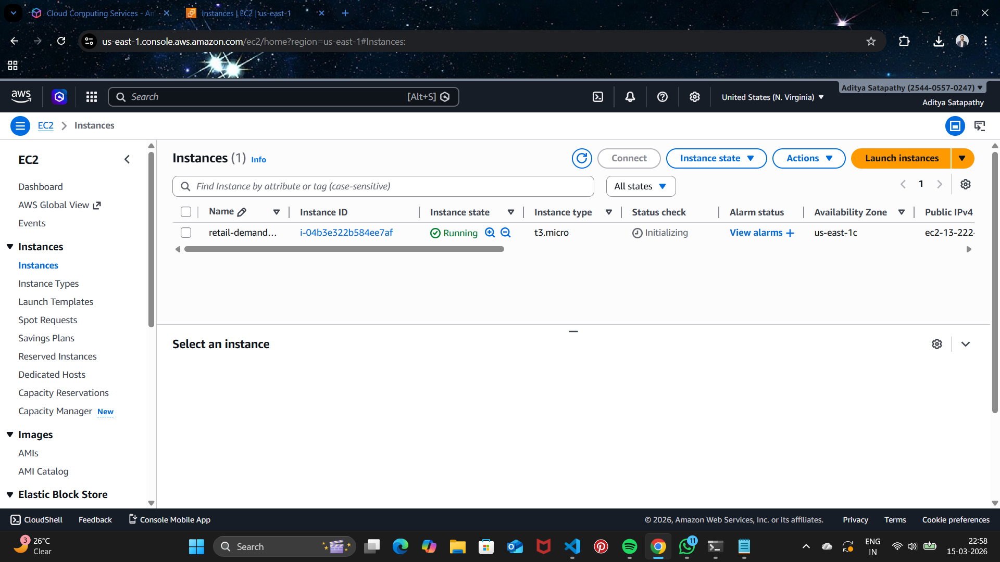
</p>

<p align="center">
  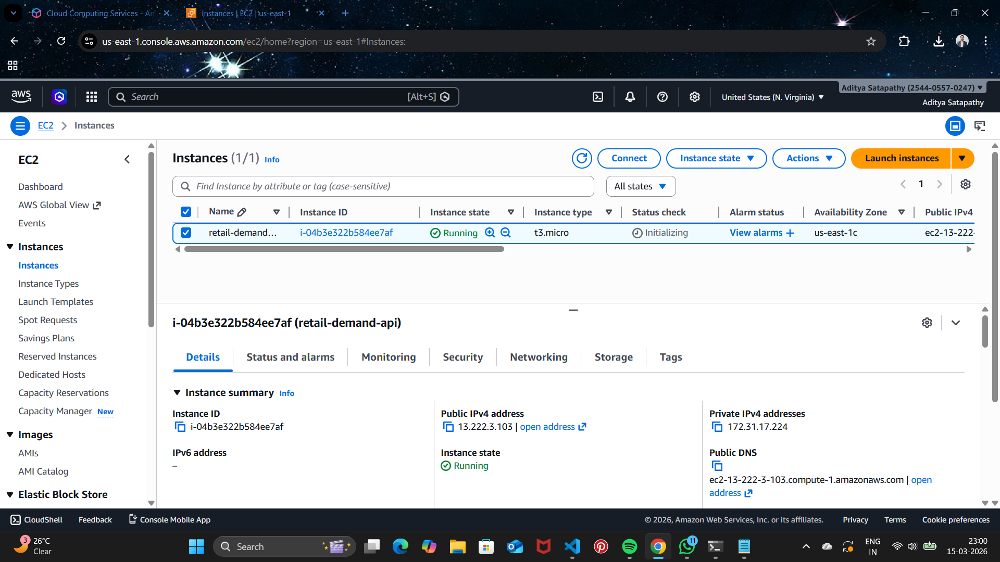
  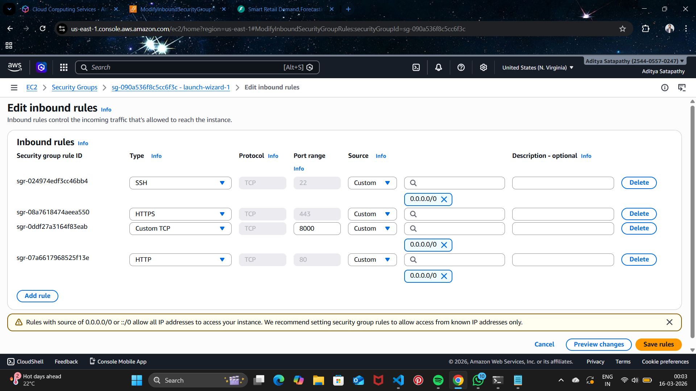
</p>

<p align="center">
  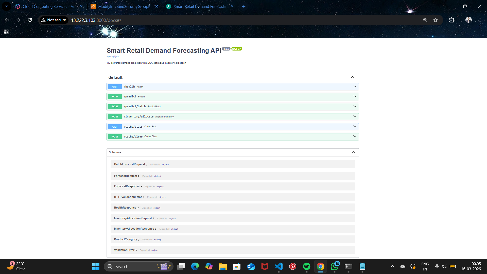
  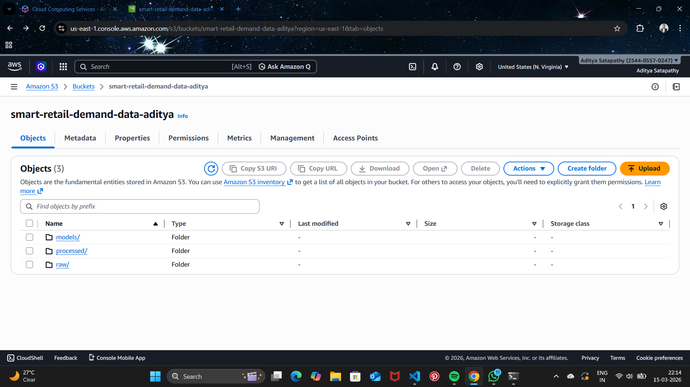
</p>


<p align="center">
  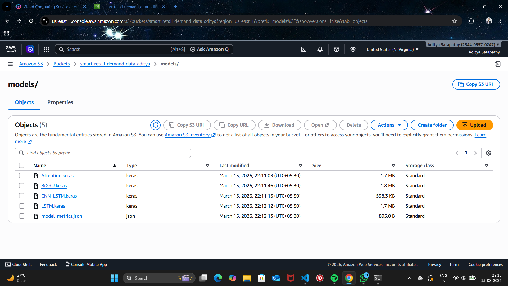
  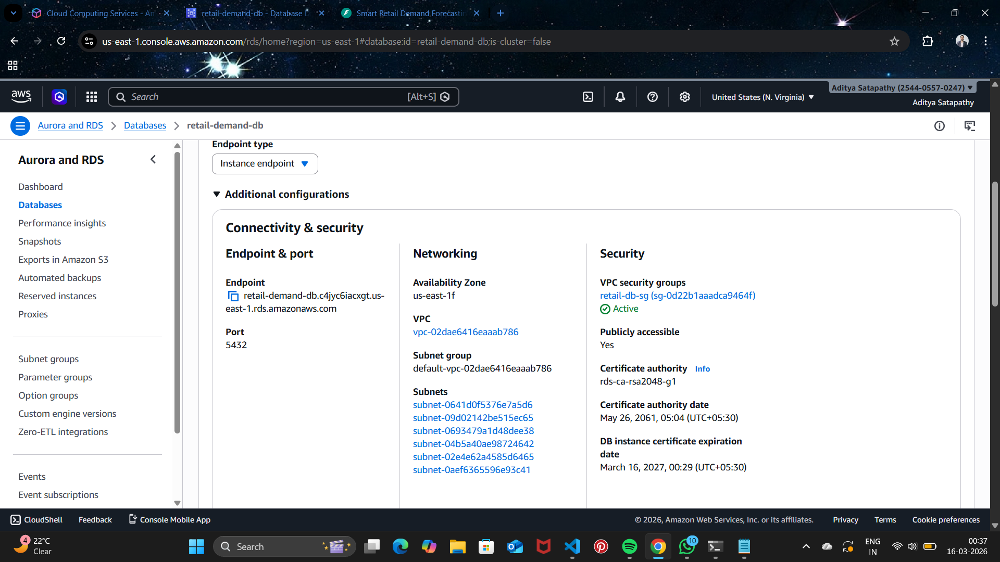
</p>

---

## Interactive Dashboard

- **Tableau Public (online)**: [SMART RETAIL DEMAND DASHBOARD IN TABLEAU PUBLIC](https://public.tableau.com/views/SMARTRETAILDEMANDDASHBOARD/SMARTRETAILDEMANDINVENTORYOPTIMIZATIONDASHBOARD?:language=en-US&publish=yes&:sid=&:redirect=auth&:display_count=n&:origin=viz_share_link)
- **Local HTML**: [INTERACTIVE DASHBOARD](https://raw.githack.com/gitadi2/smart-retail-demand/master/dashboards/retail_demand_dashboard.html)
  
---

## Docker (Optional)

> **Prerequisite:** Install [Docker Desktop](https://www.docker.com/products/docker-desktop/) first.

```bash
docker build -t smart-retail-demand .
docker run -p 8000:8000 smart-retail-demand
```

**Without Docker** — run the API directly:

```bash
uvicorn src.api.forecasting_api:app --host 0.0.0.0 --port 8000
```

---

## Author

ADITYA SATAPATHY
[https://www.linkedin.com/in/adisatapathy](https://www.linkedin.com/in/adisatapathy)
