# RETAIL DEMAND FORECASTING (Leakage-Safe MLOps) + DYNAMIC PROGRAMMING INVENTORY SOLVER

End-to-end retail demand forecasting system — built so the accuracy number is
**trustworthy**: leakage-safe features, rolling-origin walk-forward validation, an
automated leakage audit that gates CI, drift monitoring, a latency-benchmarked
FastAPI service, and a **C++ vector-index cold-start engine** for forecasting
brand-new products — plus DSA-optimized inventory allocation, all deployable on AWS.

> **Headline:** on realistic, noisy demand the model reaches **WMAPE 24.5% (R² 0.81)**,
> a **~48% improvement over a seasonal-naive baseline** — and a built-in audit proves
> no feature leaks the target. For brand-new products with zero history, a C++
> similarity index borrows demand from similar items and cuts cold-start error by
> **16%**. (A retail demand model claiming R² ≈ 0.99 is leaking; this project proves it isn't.)

<p align="left">
<a href="https://www.python.org" target="_blank" rel="noreferrer"></a>
<a href="https://isocpp.org/" target="_blank" rel="noreferrer"></a>
<a href="https://scikit-learn.org/" target="_blank" rel="noreferrer"></a>
<a href="https://xgboost.readthedocs.io/" target="_blank" rel="noreferrer"></a>
<a href="https://lightgbm.readthedocs.io/" target="_blank" rel="noreferrer"></a>
<a href="https://www.tensorflow.org/" target="_blank" rel="noreferrer"></a>
<a href="https://keras.io/" target="_blank" rel="noreferrer"></a>
<a href="https://fastapi.tiangolo.com/" target="_blank" rel="noreferrer"></a>
<a href="https://www.postgresql.org" target="_blank" rel="noreferrer"></a>
<a href="https://aws.amazon.com" target="_blank" rel="noreferrer"></a>
<a href="https://www.docker.com/" target="_blank" rel="noreferrer"></a>
<a href="https://mlflow.org/" target="_blank" rel="noreferrer">  </a>
<a href="https://git-scm.com/" target="_blank" rel="noreferrer"></a>
<a href="https://github.com/features/actions" target="_blank" rel="noreferrer"></a>
<a href="https://pandas.pydata.org/" target="_blank" rel="noreferrer"></a>
<a href="https://numpy.org/" target="_blank" rel="noreferrer"></a>
<a href="https://matplotlib.org/" target="_blank" rel="noreferrer"></a>
<a href="https://docs.pytest.org/" target="_blank" rel="noreferrer"></a>
<a href="https://www.tableau.com/" target="_blank" rel="noreferrer"></a>
</p>

---

## Why this is built differently

| Common pitfall | This project |
|---|---|
| `rolling(7).mean()` on the target (includes `y[t]` → leak) | rolling stats on the `.shift(1)` series — window ends at `t-1` |
| random train/test split on time-ordered data | chronological split + rolling-origin walk-forward CV |
| a single headline accuracy number | distribution across 5 folds, always vs a baseline |
| no leakage check | automated **target-perturbation audit** as a CI hard gate |
| new products forecast as a global average | **C++ vector index** borrows demand from similar products |
| "trained a model" | drift detection, performance-regression tests, latency SLOs |

See **[DESIGN.md](DESIGN.md)** for the reasoning behind every choice — the leakage
story, why gradient boosting over deep nets, and the cold-start design.

---

## Architecture

```
┌────────────┐   ┌────────────┐   ┌──────────────┐   ┌──────────────────────┐
│  Raw / M5  │──▶│  Cleaning  │──▶│  Validation  │──▶│  LEAKAGE AUDIT (gate) │
│   data     │   │ dedup/types│   │ data contract│   │ target-perturbation   │
└────────────┘   └────────────┘   └──────────────┘   └──────────┬───────────┘
                                                                 │ pass
                                          ┌──────────────────────▼───────────┐
                                          │  Leakage-safe Feature Engineering │
                                          │  lag + rolling on shift(1), cyclic│
                                          └───────┬───────────────────┬───────┘
                       has history                │                   │  NEW product (no history)
                              ┌───────────────────▼──────┐   ┌─────────▼──────────────────┐
                              │  Walk-forward CV vs        │   │  C++ Vector Index (AVX2)   │
                              │  seasonal-naive baseline   │   │  embed → k-NN similar items│
                              │  → train best model        │   │  → neighbour demand prior  │
                              └───────────────────┬──────┘   └─────────┬──────────────────┘
                                                  │                    │
                            ┌─────────────────────┼────────────────────┘
                            │                     │
              ┌─────────────▼──────┐   ┌──────────▼─────────────┐   ┌──────────────────┐
              │  Inventory Optim.  │   │ FastAPI /predict (LRU) │   │ Drift Monitor PSI│
              │  DP + Binary Search│   │       p99 ≈ 2 ms       │   │  retrain trigger │
              └────────────────────┘   └──────────┬─────────────┘   └──────────────────┘
                                                   │
                                      ┌────────────▼────────────┐
                                      │   AWS: EC2 + S3 + RDS    │
                                      └──────────────────────────┘
```

---

## Model Performance

> Numbers are from the leakage-safe pipeline (`python run_pipeline.py`), reproducible
> with a fixed seed. Swap in a real dataset (M5 / Rossmann / Favorita) to benchmark
> against public leaderboards — see [Using a real dataset](#using-a-real-dataset).

**Walk-forward CV — 5 folds × 28-day horizon (WMAPE, lower is better):**

| Model | WMAPE | vs baseline |
|-------|-------|-------------|
| **Gradient Boosting (HGB / XGBoost / LightGBM)** | **24.5% ± 0.40** | **−48%** |
| Seasonal-naive (baseline) | 46.8% ± 0.45 | — |

**Final temporal holdout (last 56 days):** WMAPE 24.5% · R² 0.81 · MAE 2.80 · bias −1.02

Gradient boosting is the production engine (handles missing lag values natively,
fast, strong on tabular data). Deep sequence models (LSTM / BiGRU / CNN-LSTM /
Attention) were evaluated but did not beat gradient boosting on this calendar- and
price-driven tabular data, so they were not worth the training cost — a deliberate
trade-off documented in [DESIGN.md](DESIGN.md).

<p align="center">
  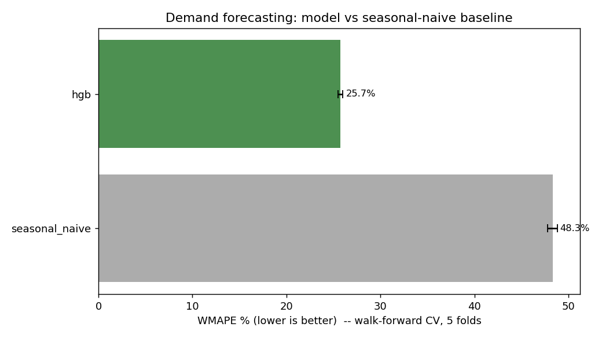
</p>

---

## Leakage safety (the part that matters)

`src/audit/leakage.py` runs a **target-perturbation test**: perturb `y` at the last
row of each series, rebuild features, and assert nothing at that row moved. A
leakage-free feature for row `t` uses only rows `< t`, so it can't move. This catches
the same-row-rolling-mean bug regardless of how it's named, and runs in CI before any
model trains:

```
$ python -m src.audit.leakage
=== Clean pipeline ===   target_perturbation: OK: no feature uses y[t]    -> PASS
=== Leaky pipeline ===   target_perturbation: LEAK via ['roll_mean_7_LEAK'] -> FAIL
```

---

## Cold-start forecasting (C++ vector index)

A brand-new product has no sales history, so every lag/rolling feature is null and a
standard model can only guess its demand level. This system embeds each product
(category + price band via the metadata backend, or a sentence-transformer embedding
in production), indexes the embeddings in a **C++ AVX2 cosine-similarity index**
(`vector_index/index.cpp`, called from Python via ctypes — no pybind11), and for a
new product retrieves its *k* most similar existing products. Their training-period
weekday demand profile becomes a leakage-safe `neighbour_prior` feature for a
dedicated cold-start model.

- **Measured lift:** cold-start WMAPE **58.8% → 49.1%, a 16% improvement** on products
  the model had never seen (`python -m experiments.cold_start`).
- **Index latency:** ~18 µs over 1k vectors, ~0.6 ms over 50k (brute-force AVX2).
- **Leakage-safe:** a product's prior is built only from *other* products' *training*
  demand — a unit test asserts that perturbing a product's own demand does not move
  its prior (`tests/test_cold_start.py`).
- **Portable:** falls back to a numpy implementation when the C++ `.so` isn't built,
  so it runs anywhere; the C++ path compiles automatically in the Linux deploy image.

```
$ python -m experiments.cold_start_demo
NEW product P0028 [Produce, $27.15]
  nearest existing products (cosine sim):
    P0006 [Produce, $31.67]  sim=0.99  avg demand=11.4
    ...
  --> borrowed demand level (prior): 11.0   (naive global-mean guess: 7.8)
```

---

## Inventory Optimization

Dynamic Programming and Binary Search optimize inventory allocation across stores:

| Metric | Value |
|--------|-------|
| Fill Rate | 100.0% |
| Inventory Used | 265 units |
| Inventory Remaining | 4,735 units |
| Safety Stock | 147 units |
| Reorder Point | 245 units |
| Service Level | 95% |
| Anomalies Detected | 0 |

---

## Tech Stack

| Layer | Technology |
|-------|-----------|
| **ML (production)** | scikit-learn HistGradientBoosting, optional XGBoost / LightGBM · log1p target transform |
| **Deep learning (explored)** | TensorFlow/Keras — LSTM, BiGRU, CNN-LSTM, Attention |
| **Cold-start (AI)** | C++ AVX2 vector index (ctypes), product embeddings (metadata + sentence-transformer hook), neighbour demand prior |
| **Validation** | Rolling-origin walk-forward CV, chronological splits, WMAPE / MAE / RMSE / R² / bias |
| **Quality gates** | Target-perturbation leakage audit, data-contract validation, performance-regression tests |
| **Monitoring** | PSI drift detection |
| **DSA** | Dynamic Programming, Binary Search, Sliding Window, Min-Heap, LRU Cache, Hash Map, SIMD k-NN |
| **API** | FastAPI, Uvicorn, Pydantic validation, LRU cache (p99 ≈ 2 ms) |
| **Database** | PostgreSQL on AWS RDS, SQLAlchemy ORM |
| **Cloud** | AWS EC2, S3, RDS |
| **Experiment Tracking** | MLflow |
| **DevOps** | Docker, GitHub Actions CI/CD (audit + tests), Git |
| **Visualization** | Tableau, Matplotlib, Seaborn, Chart.js |

---

## Project Structure

```
smart-retail-demand/
├── run_pipeline.py              # generate → validate → AUDIT(gate) → features → walk-forward CV → train → drift
├── requirements.txt
├── Dockerfile
├── README.md
├── DESIGN.md                    # decisions, trade-offs, leakage + cold-start story
├── .github/workflows/ci.yml     # CI: leakage audit gate + tests on every push
│
├── src/
│   ├── data/
│   │   ├── generate.py          # synthetic generator (honest noise) + real-dataset loader stub
│   │   ├── data_cleaning.py     # type casting, dedup, derived columns
│   │   └── validation.py        # schema + data-contract checks (hard gate)
│   ├── features/
│   │   └── engineering.py       # LEAKAGE-SAFE: lag + rolling on shift(1), cyclical encoding
│   ├── eval/
│   │   ├── metrics.py           # WMAPE, MAE, RMSE, R², bias
│   │   └── validation.py        # temporal split + rolling-origin walk-forward CV
│   ├── models/
│   │   ├── train.py             # gradient boosting (HGB/XGBoost/LightGBM), log1p target
│   │   └── baselines.py         # seasonal-naive baseline
│   ├── audit/
│   │   └── leakage.py           # target-perturbation leakage audit (CI hard gate)
│   ├── monitoring/
│   │   └── drift.py             # PSI drift detection
│   ├── cold_start/              # the AI feature
│   │   ├── embeddings.py        # metadata backend + sentence-transformer hook
│   │   ├── neighbor_prior.py    # leakage-safe neighbour demand prior
│   │   └── vector_index.py      # ctypes wrapper for the C++ index + numpy fallback
│   ├── inventory_optimizer.py   # DP allocation, binary search reorder, sliding window
│   ├── api/
│   │   ├── forecasting_api.py   # FastAPI: /predict, /batch, /inventory
│   │   └── schemas.py           # Pydantic request/response models
│   └── utils/
│       ├── algorithms.py        # DP, binary search, sliding window, min-heap
│       └── data_structures.py   # LRU Cache, SortedDemandArray, DemandBucketMap
│
├── vector_index/                # C++ similarity engine
│   ├── index.cpp                # AVX2 cosine search, extern "C" API
│   └── build.sh                 # g++ -O3 -march=native → libvecindex.so
│
├── sql/
│   ├── 01_create_schema.sql     # PostgreSQL schema
│   ├── 02_create_tables.sql     # Table definitions
│   ├── 03_etl_pipeline.sql      # SQL-based ETL
│   ├── 04_feature_engineering.sql   # NOTE: offset rolling windows by 1 row (no same-row aggregates)
│   └── 05_analytics_views.sql   # Aggregated views for dashboards
│
├── experiments/
│   ├── cold_start.py            # with/without-prior cold-start WMAPE proof
│   └── cold_start_demo.py       # human-readable neighbour matches
│
├── benchmarks/
│   └── latency.py               # p50/p95/p99 + batch throughput
│
├── tests/
│   ├── test_all.py              # leakage regression + performance-regression gate
│   ├── test_cold_start.py       # vector index + prior leakage-safety
│   ├── test_algorithms.py       # DP, binary search, sliding window tests
│   ├── test_api.py              # API schema validation tests
│   └── test_data_structures.py  # LRU cache, sorted array, bucket map tests
│
├── data/
│   ├── raw/                     # retail_sales.csv, products.csv, stores.csv (or M5)
│   └── processed/               # cleaned_sales.csv, model_metrics.csv
│
├── models/                      # Trained model + feature_order.json + metrics (gitignored)
├── reports/figures/             # cv_wmape.png, inventory & comparison charts
├── dashboards/                  # Interactive HTML dashboard
└── screenshots/                 # Tableau + Swagger UI + AWS Cloud screenshots
```

---

## Quick Start

### 1. Clone & Setup

```bash
git clone https://github.com/gitadi2/smart-retail-demand.git
cd smart-retail-demand
python -m venv venv
venv\Scripts\activate        # Windows
# source venv/bin/activate   # macOS/Linux
pip install -r requirements.txt
```

### 2. Run the forecasting pipeline

```bash
python run_pipeline.py
```

Stages: generate/load → validate → **leakage audit (halts on leak)** → leakage-safe
features → walk-forward CV vs baseline → train best model → DP inventory optimize →
PSI drift report.

### 3. See the cold-start AI feature

```bash
python -m experiments.cold_start_demo     # which similar products a new item borrows from
python -m experiments.cold_start          # cold-start WMAPE without vs with the prior
```

Optional — build the C++ index for the fast path (Linux/macOS/WSL):

```bash
bash vector_index/build.sh                # → vector_index/libvecindex.so
```

On Windows without a compiler it auto-uses the numpy fallback (same results).

### 4. Verify audit, tests, benchmarks

```bash
python -m src.audit.leakage     # pass/fail demo on clean vs leaky features
python -m benchmarks.latency    # p50/p95/p99 + throughput
pytest tests/ -v                # leakage + performance-regression + cold-start gates
```

### 5. Launch the API

```bash
uvicorn src.api.forecasting_api:app --port 8000
```

Open Swagger UI: [http://localhost:8000/docs](http://localhost:8000/docs)

---

## Using a real dataset

The pipeline is dataset-agnostic. Implement `load_real_dataset()` in
`src/data/generate.py` to return the project schema (`date, store_id, product_id,
category, price, is_promotion, is_holiday, units_sold`) from **M5 / Rossmann /
Favorita**, and every stage — validation, audit, features, CV, cold-start, serving —
works unchanged, with WMAPE now directly comparable to public leaderboards.

---

## API Endpoints

| Endpoint | Method | Description |
|----------|--------|-------------|
| `/health` | GET | Model status, cache stats, version |
| `/predict` | POST | Single demand forecast |
| `/predict/batch` | POST | Batch forecast (up to 500 items) |
| `/inventory/allocate` | POST | DP-based inventory allocation across stores |
| `/cache/stats` | GET | Cache utilization metrics |
| `/cache/clear` | POST | Clear prediction cache |

**Serving latency (predict path):** p50 ≈ 1.2 ms · p95 ≈ 1.6 ms · p99 ≈ 2.0 ms · ~79k pred/s batched

---

## Algorithms & Data Structures

| Component | Complexity | Purpose |
|-----------|-----------|---------|
| **SIMD k-NN (C++ index)** | O(n·d), AVX2 | Cold-start product similarity search |
| **DP Inventory Allocation** | O(n × W) | Optimal stock distribution across stores |
| **Binary Search Reorder** | O(log n) | Find optimal reorder point for service level |
| **Sliding Window** | O(n) single pass | Rolling demand anomaly detection |
| **Min-Heap Top-K** | O(n log k) | Identify top stockout risk products |
| **LRU Cache** | O(1) get/put | Cache repeated prediction requests |
| **SortedDemandArray** | O(log n) query | Fast percentile & threshold lookups |
| **DemandBucketMap** | O(1) lookup | Demand aggregation by segment |

---

## Screenshots

<p align="center">
  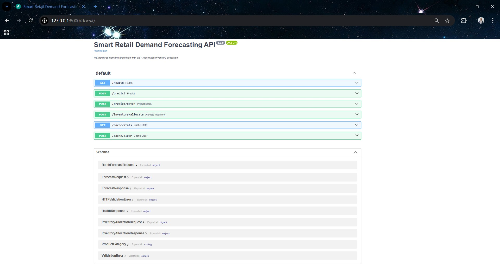
</p>

<p align="center">
  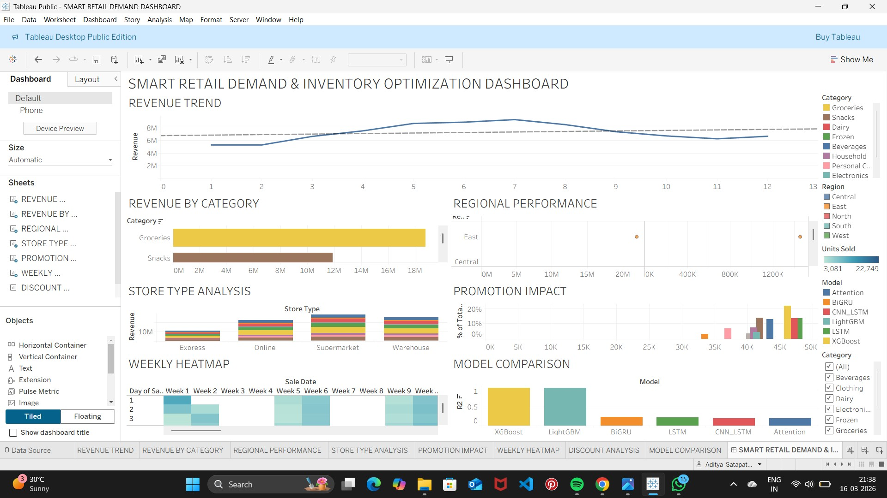
</p>

<p align="center">
  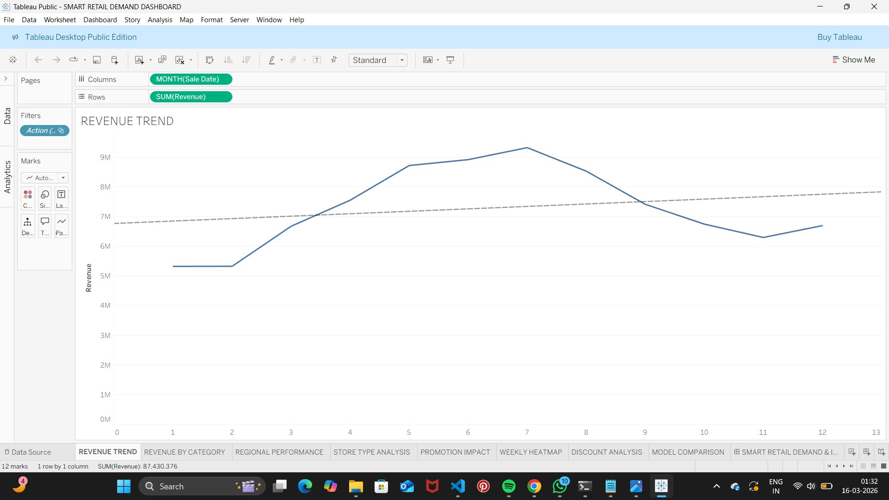
  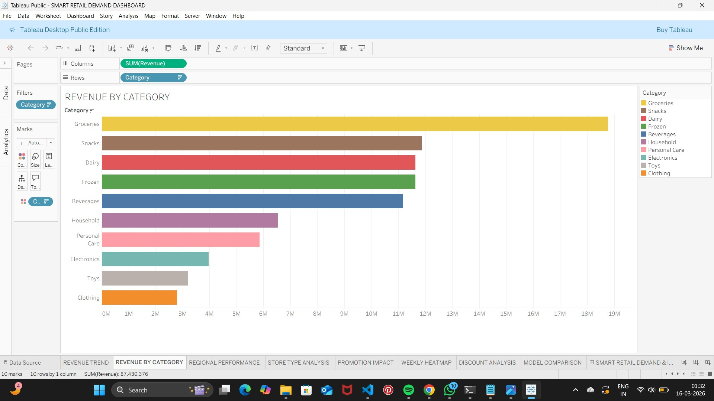
</p>

<p align="center">
  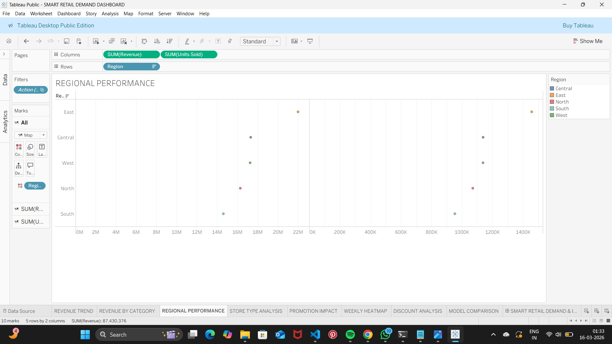
  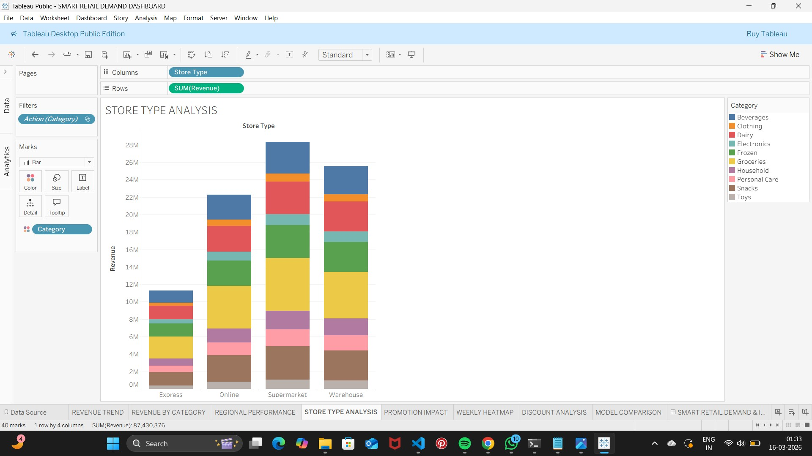
</p>

<p align="center">
  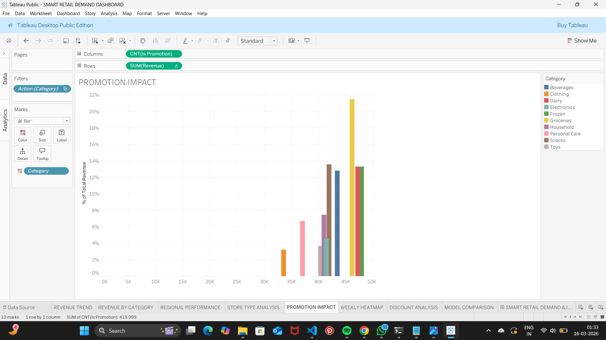
  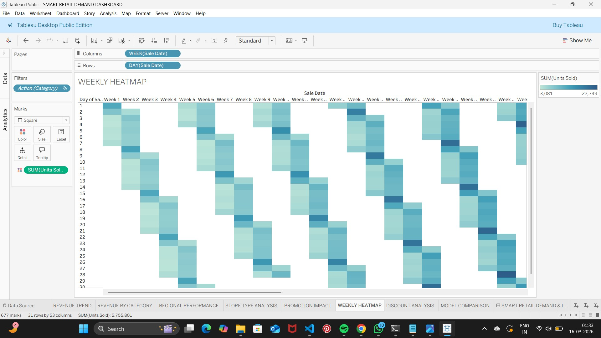
</p>

<p align="center">
  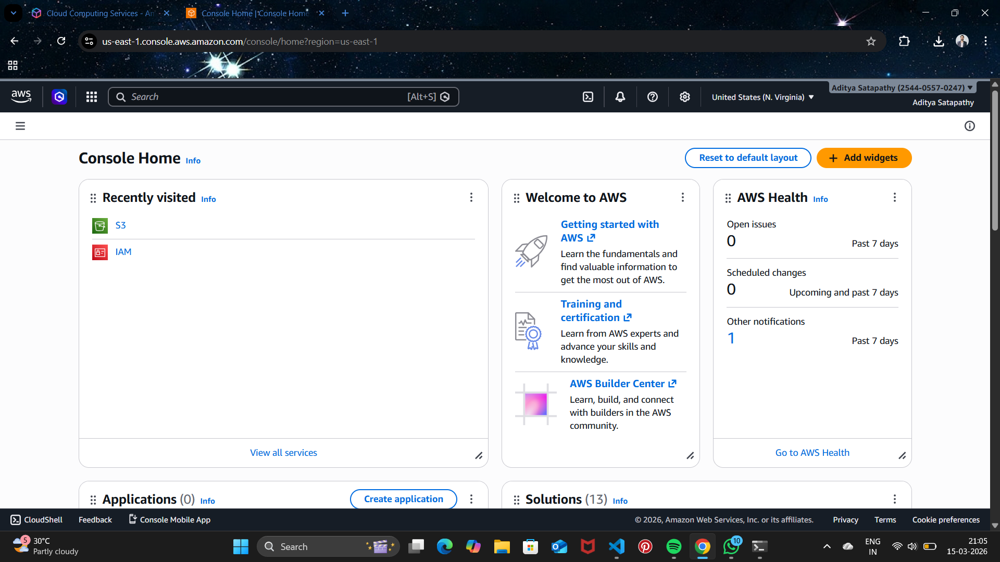
  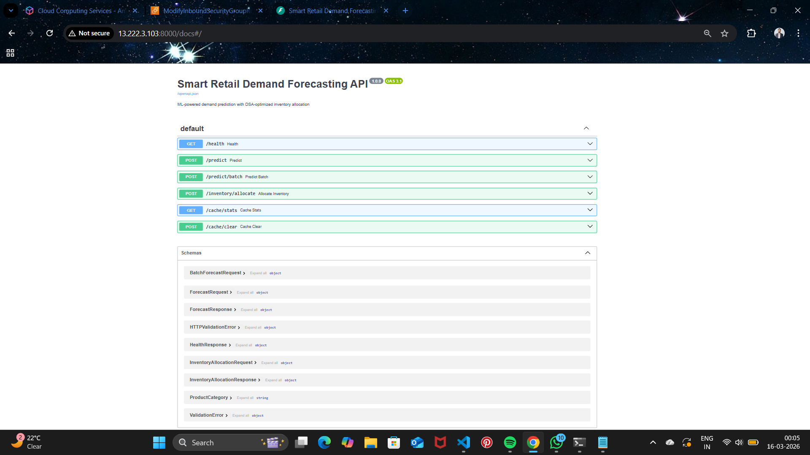
</p>

---

## Interactive Dashboard

- **Tableau Public**: [SMART RETAIL DEMAND DASHBOARD](https://public.tableau.com/views/SMARTRETAILDEMANDDASHBOARD/SMARTRETAILDEMANDINVENTORYOPTIMIZATIONDASHBOARD?:language=en-US&publish=yes&:sid=&:redirect=auth&:display_count=n&:origin=viz_share_link)
- **Local HTML**: [INTERACTIVE DASHBOARD](https://raw.githack.com/gitadi2/smart-retail-demand/master/dashboards/retail_demand_dashboard.html)

---

## Docker

```bash
docker build -t smart-retail-demand .      # compiles the C++ index inside the image
docker run -p 8000:8000 smart-retail-demand
```

---

## Author

<h3> ADITYA SATAPATHY </h3>
<a href="https://github.com/gitadi2" target="blank"></a>
<a href="https://linkedin.com/in/adisatapathy" target="blank"></a>
<a href="mailto:satgriezeleo1007@gmail.com" target="blank"></a>
